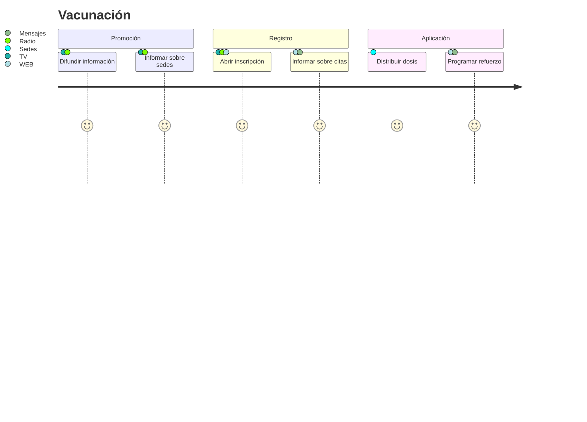

# Vacunación

Para realizar la campaña de vacunación se realizarán 3 fases principales:

### Promoción

Se realizará una campaña de promoción donde se informará sobre los síntomas de la enfermedad, los pasos a seguir en caso de presentarlos, y la importancia de la vacunación para la salud pública general.

La promoción se realizará de manera masiva en radio y televisión.

### Registro

Se diseñará una aplicación web para el registro y seguimiento de las dosis aplicadas.

La aplicación se encargará de registrar a los usuarios, generará las citas, e informará sobre las sedes asignadas, así como los horarios de aplicación.

Al recibir la primera dosis, la aplicación generará un periodo para el refuerzo.

### Aplicación

La aplicación se realizará en distintas sedes, buscando que el desplazamiento de las personas sea el menor posible, se distribuirá a las personas por edad, en diferente semana, y por primer letra del apellido en diferentes días de la semana.

Para la aplicación se dará preferencia a las personas con mayor edad, por lo que el primer grupo de personas será de 60 años o más, y agrupando a la población en segmentos de 10 años cumplidos.

 	
